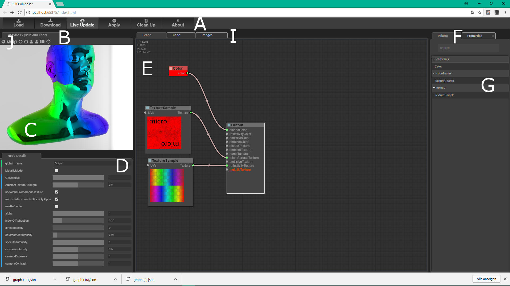
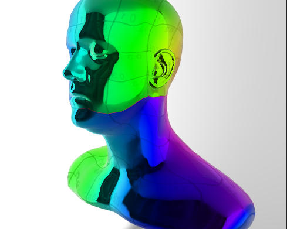
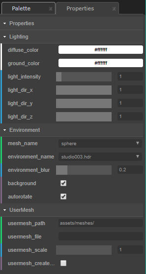
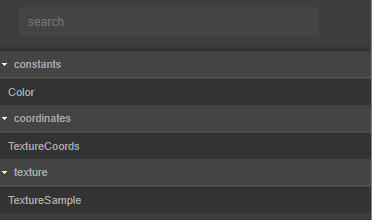
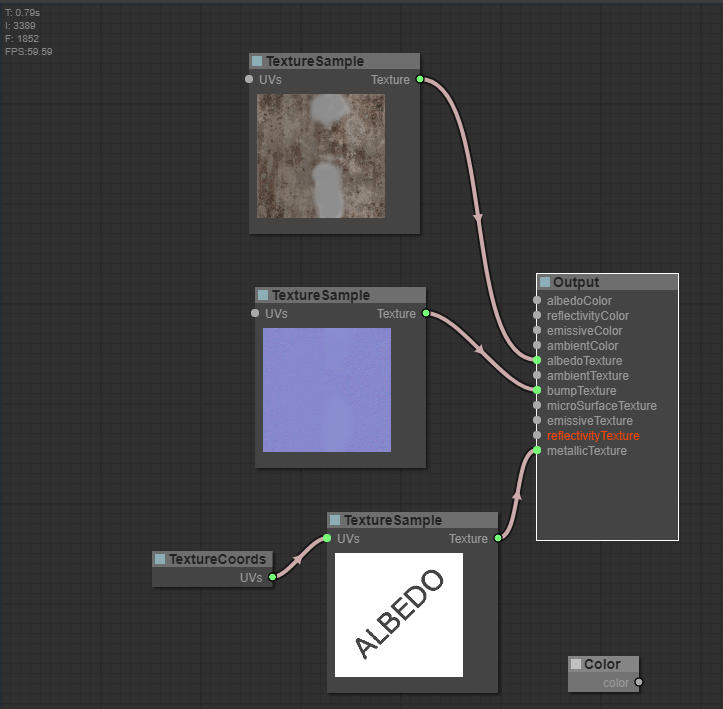
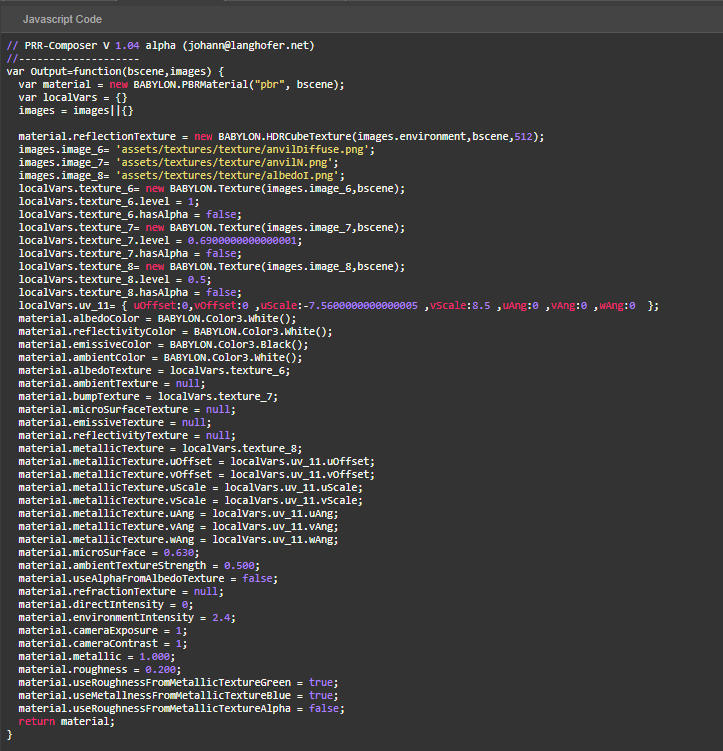
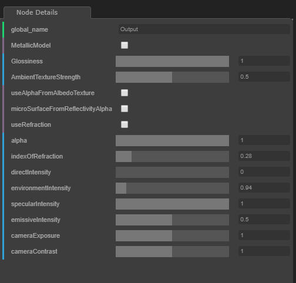

# User Interface

## Button Bar (A)

### Load
Load graphs here or drag graphs into the Graph Panel (E).
### Download
Download the graph for later usage (graph doesn't contain sourcecode).
### LiveUpdate
When pressed (arrows spinning) all user actions were live evaluated and the sourcecode will be kept up-to-date.
### Apply
The Apply button forces an extra evaluation cyle to synchronize all components.
### CleanUp
Clears the entire graph to its initial state. A confirm message dialog will be shown before this action takes place.
### About
Shows the Aboutbox for further information.
## Preview Panel (B,C,J)
### Header (B)

Shows the currently used environment map. Environment maps can be changed by pressing the cycle button on the Preview Toolbar (J)
### Preview Toolbar (J)

The buttons from this toolbar provide following functions:
* visualize 3 stock meshes (you also can drop meshes (.babylon files) into the Render Panel (C).
* visualize an user defined mesh
* toggle background
* toggle autorotate function
See the tooltips to identify the specific functionality.
### Render Panel (C)

The whole 3D scene will be rendered here. Files can be dropped here (*.babylon) to render an individual mesh.
## Right Side Panel 
### Right Side Header (F)

Here you can select between the Palette and the properties for environment settings.
### Properties

In this properties settings the environment conditions for the whole scene is set. This properties are saved within the graph to reproduce the same light and environment situation after reloading a graph. 
### Palette (G)

From the palette at the moment 3 nodes can be dragged into the Graph Panel (E): Color, TextureCoords and TextureSample.
## MainPanel
### Header (I)

In the Header there are 3 Tabs:
* Graph, selecting the Graph Panel (E)
* Code, selecting the sourcecode 
* Images, selecting the sourcecode for image declarations
### Graph Panel (E)

Nodes can be dropped from the Palette (G) here. Nodes can be connected by left-clicking an output port and dragging to a matching input-target port and releasing the mousebutton. During this drag operation, only the matching ports will be highlighted and other ports are not connectable. Individual nodes, not connectd to a input port on the Output node, doesn't generate sourcecode but they can be arranged for later use or for experimental usage as "standby-nodes".
Each node also have a context menu (rightclick) to select different operations on the nodes where you can:
* assign Colors to a node
* assign shapes to a node
* clone nodes
* remove nodes
#### Drag an Drop (DnD) operation
Inbetween the Graph Panel different DnD operations can be performed:
* dropping a graph-file (*.graph) to the panel (dowloaded from a previous session).
* dropping an image file (*.jpg,png etc.) to a TextureSample-Node.
* dropping nodes from the Palette to the Panel.

**Note:** the url of a file-image dropping to a TextureSample-Node is changed to a datasource-url (a Base64 encoded string) and the information about the sourcepath is lost. Thus, in this case the output sourcecode will grow up because of the embedded image.

Finally nodes can be arranged in the Graph Panel and they can be zoomed with the mouswheel.
### Code Panel

Here is the sourecode representing the connected nodes on the Graph Panel. Note, that the name of the Output function can 
be renamed by a specific property on the Details Panel (D).  The Code Panel is updating live as long the Live Update Button on the Button Bar (A) is spinning. The content of the Code Panel can can be copied and pasted for programming purposes.

### Images Panel

Here is the sourecode representing the ressources used in the Code Panel. The content can can be copied and pasted for programming purposes as in the Code Panel. This panel was seperated from the Code Panel due the fact, that Nodes with data Images are very big (Base64 encoded string format) and this would be a performace issue during the Live Update.
## Node Detail Panel (D)

In this panel the details of a selected node can be edited. This panel changes its layout depending of the selected node. If you are not sure, which parameter changes which parts of the sourcecode, switch to the Code Tab in the Main Panel and you will see the influence.

